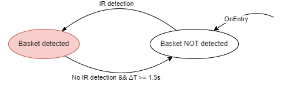
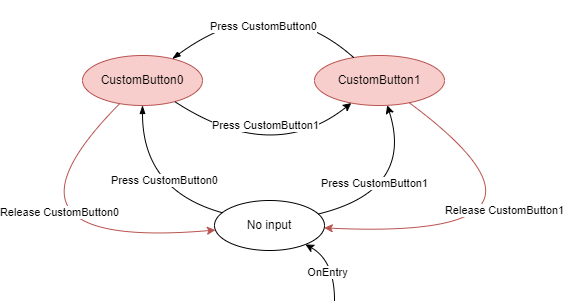
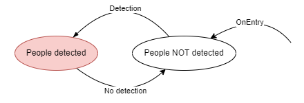
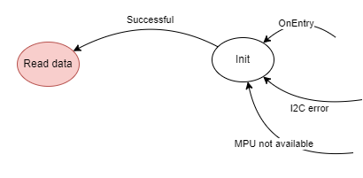

# Firmware

## Configuration

Before uploading the firmware on the MCU, it requires to be configured. The configuration is done by copying the file `include/config.example.h`
to the file `include/config.h`. After copying, the following parameters must be set:

- `SMP_AP_SSID`: The SSID of the Access Point (or AP) to which the MCU will connect to.
- `SMP_AP_PASSWORD`: The password of the AP.
- `SMP_BRIDGE_IP_ADDRESS`: The IP address of the server hosted on the Bridge.
- `SMP_BRIDGE_PORT`: The port of the Bridge's server.

Once configured, the firmware can be uploaded on the MCU.

## Execution

### Initialization

The firmware initialization is what is contained in the `setup()` function, according to the Arduino framework. It is composed of the following steps:

- **Derivation of the Basket ID**: In order to make the Basket ID permanent over rebooting or re-flashing of the MCU, it's dynamically derived from the MAC address of the Wireless module:

```c++
uint8_t basket_id[4];
uint8_t digest[20];

sha1(mac, digest);
for (i = 0; i < 20; i++)
    basket_id[i % 4] ^= digest[i];
```

- **PIN initialization**: The assigned I/O pins are initialized.

- **Connection to the AP**: The MCU connects to the AP using the SSID and password specified in the configuration. <ins>During this phase the on-board LED0 will blink</ins>. If it's the first connection the AP, this process may be slow (could possibly take up to several minutes) and will be faster in the following connection attempts.

### The loop

After the MCU has initialized, it loops over this procedure:

- **If disconnected, try to establish a TCP connection towards the Bridge** using the IP address and port specified in the configuration
- **Query the IR detector** (for a possible score detection)
- **Query custom buttons input**
- **Query the people detector**
- **Query the accelerometer**

Whenever a measurement is produced, it is sent to the Bridge over the established TCP connection, and is structured according to [our custom binary protocol](./protocol). <ins>After a packet is delivered, the on-board LED1 will light for a small amount of time</ins>.

## Querying from peripherals

The process of querying from a peripheral is designed with the aid of finite-state machines (FSM), for every peripheral. FSM have been generally used to handle several states of the peripheral including possible disconnection, need of re-initialization, but mostly in order to have a unique callback when an input is firstly receive that will correspond to the delivery of the respective packet.

In the following diagrams, the states highlighted in red are the states where a packet is sent as soon as the state is entered. The only exception is the Accelerometer's "Read data" state that as long as the MCU is in this state it will repeatedly deliver packets, interspersed by some amount of time.

### Basket detection FSM

<p align="center">
  
</p>

### Custom buttons FSM

<p align="center">
  
</p>

### People detection FSM

<p align="center">
  
</p>

### Accelerometer FSM

<p align="center">
  
</p>
