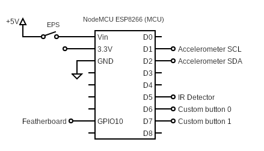
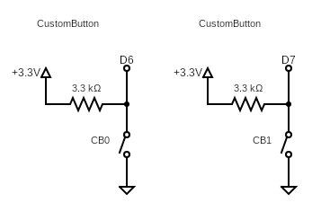
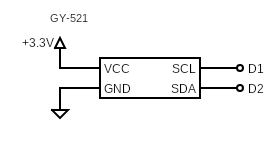
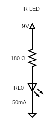
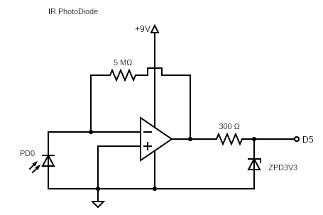
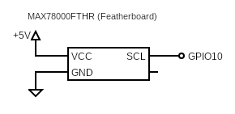
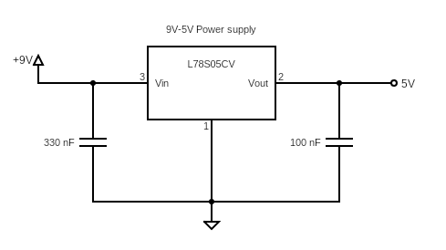

# Schematic

## Power supply

The power supply must be able to provide 9V and it must be able to support the circuit functionalities. We haven't measured the minimum required power,
for our prototype we sticked to a power supply able to provide up to 850mA.

## The MCU

The SmartBasket logic and connectivity is performed by an ESP8266, mounted on a NodeMCU board. The MCU is powered throughout the `Vin` pin and the `EPS` switch permits to turn off the external power supply whether the MCU is powered from the USB port. The on-board voltage regulator will provide 3.3V output.

  

As shown in the diagram above, the GPIOs are organized the following way:
- `D0`: -
- `D1`: I2C's SCL
- `D2`: I2C's SDA
- `D3`: -
- `D4`: -
- `D5`: digital input from IR Detector (0 if the ball is passing through the basket)
- `D6`: digital input from CustomButton0 (0 if pressed)
- `D7`: digital input from CustomButton1 (0 if pressed)
- `D8`: -
- `SDD3 (GPIO10)`: digital input from the Featherboard (1 if a person is detected)

## Custom button(s)

The SmartBasket provides two custom buttons that enable the users to interact with the device. Their functionality can vary and, generally, is server-defined. The circuit consists of a pull-up resistor attached to the button; therefore the output will be high if the button isn't pressed, otherwise low if pressed.

  

### Accelerometer

The SmartBasket also mounts an accelerometer whose objective is to detect the oscillations of the backboard and provide additional information to evaluate whether the basket is being used or not. The module used is GY-521 that embeds an MPU6050. It communicates with the MCU through an I2C bus (two wires: SCL and SDA).

  

## BasketDetector

The BasketDetector is the component that permits to the SmartBasket to detect the score. It consists of two parts: an IR LED and an IR Photodiode that look at each other. The IR LED emits an IR radiation (at ~940nm) that travels towards the IR Photodiode. This way the signal will be high as long as there's nothing in between but, when the ball pass through, the signal will be low for a small amount of time and the MCU will be able to detect the basket.

  
  

The IR Photodiode circuit consists of an Op Amp in Inverting configuration. As long as the Photodiode is lit, it generates a current going towards ground and the Op Amp generates a current going towards the MCU's `D5` pin. The resistences have been measured empirically, while the zener diode is placed to ensure the output voltage doesn't exceed 3.3V, which is the logical high value for the MCU.

## Featherboard

The Featherboard is an external board that performs People Detection and will signal the MCU whether one or more people are in front of the basket. This information is used to improve basket/court occupancy evaluation.

  

The Featherboard output is read from the `P3_1` and can be powered through the `VBUS` pin. But where do we get 5V to power it?

## 9V to 5V Voltage Regulator

We use a Voltage Regulator to convert the Power Supply's 9V to 5V that will be used to power the Featherboard and the MCU.

  

The circuit and capacities values have been taken from the [regulator's datasheet](https://www.mouser.it/datasheet/2/389/l78s-974158.pdf).

